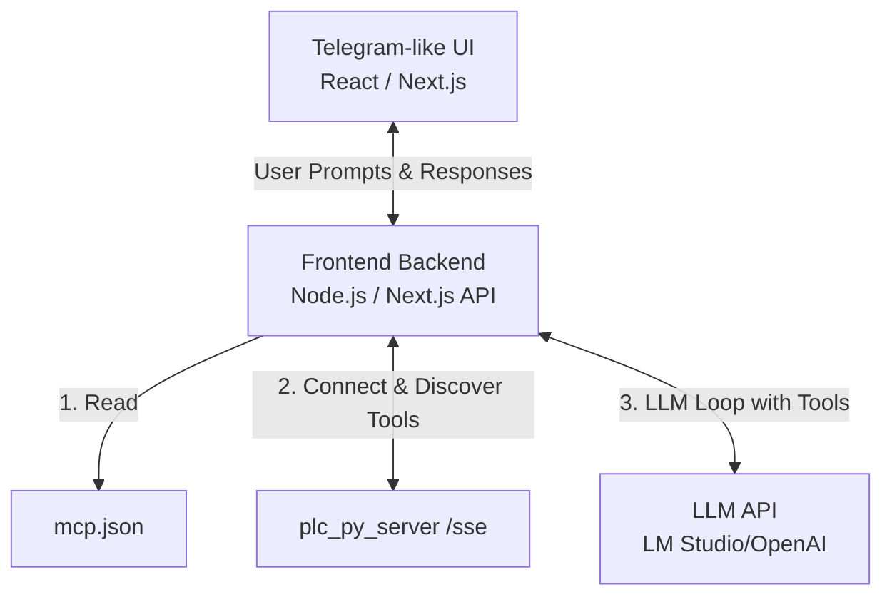

# Telegram-like MCP Frontend Design

This document details how to build a frontend (`tg_fe`) that emulates a Telegram-style chat window while acting as an **MCP Client**. Just like Antigravity or Cursor, this UI will read an `mcp.json` configuration file, connect to the configured Model Context Protocol (MCP) servers via Server-Sent Events (SSE), and provide an agentic chat experience.

## 1. Core Architecture

To accurately replicate the behavior of an MCP client (like Antigravity), the frontend must be more than just a dumb UI talking to the existing `/chat` endpoint. It needs its own backend/orchestrator to act as the MCP Client.



### Why this architecture?
Since browsers cannot easily handle standard MCP connections (due to CORS and network restrictions) and cannot natively read local files like `mcp.json`, we need a **Full-Stack** framework like **Next.js** or a **Vite + Express** setup.

## 2. Reading `mcp.json` and Connecting

The frontend backend will act exactly like an AI app host.
1. **Read Config:** At startup, parse `mcp.json` to find servers.
   ```json
   {
     "mcpServers": {
       "nodered-plc-bridge": {
         "url": "http://127.0.0.1:3002/sse"
       }
     }
   }
   ```
2. **Connect via SDK:** Use the official `@modelcontextprotocol/sdk` for TypeScript.
   ```typescript
   import { Client } from "@modelcontextprotocol/sdk/client/index.js";
   import { SSEClientTransport } from "@modelcontextprotocol/sdk/client/sse.js";

   const transport = new SSEClientTransport(new URL("http://127.0.0.1:3002/sse"));
   const client = new Client({ name: "tg_fe_client", version: "1.0.0" }, { capabilities: {} });
   await client.connect(transport);
   ```

## 3. The Telegram-like UI Details

A Telegram interface typically consists of a clean, split layout.

- **Left Sidebar (Server/Tool Details):** 
  Instead of "Contacts", the sidebar will display:
  - Connected MCP Servers (e.g., `nodered-plc-bridge`)
  - The list of active tools fetched dynamically via `await client.listTools()`
  - Model selection (e.g., connecting to LM Studio)
- **Main Chat Window (The Agent):**
  - Message Bubbles (Telegram style: colored bubbles locally, white/gray bubbles for the agent).
  - **Tool Execution Indicators:** When the model decides to call `get_pc_health`, the UI should show a small inline status: ⚙️ *Fetching PC Health...* before displaying the final answer.
- **Input Area:** 
  A simple text area with a send button (paper plane icon), supporting multi-line inputs.

## 4. The Agentic Chat Loop (Frontend Backend)

When the user types a message, the following loop happens on the Next.js/Express backend:

1. **Get Tools:** The backend queries the connected MCP clients `client.listTools()`.
2. **Format Tools:** Convert these MCP tools into the format the LLM expects (e.g., OpenAI Function Calling format).
3. **Call LLM:** Send the user's prompt + the formatted tools to the LLM (e.g., LM Studio).
4. **Execute Tools:** If the LLM returns a `tool_calls` response, the backend intercepts it, maps it back to the MCP Client, and executes `client.callTool({ name: "...", arguments: {...} })`.
5. **Resume LLM:** Feed the tool result back into the LLM context.
6. **Respond to UI:** Stream the final translated LLM output back to the React UI as a chat bubble.

## 5. Recommended Tech Stack

To build this quickly and beautifully, the following stack is recommended:

- **Framework:** **Next.js (App Router)**. It provides both the React frontend capability and the server-side API routes needed to run the MCP SDK and read `mcp.json`.
- **UI Styling:** **Vanilla CSS** or **Tailwind CSS**. (Since your application rules prefer Vanilla CSS with modern aesthetics: CSS Variables for dark mode, glassmorphism, and smooth transitions).
- **Icons:** **Lucide React** or **Phosphor Icons** for the Telegram-like UI icons.
- **AI SDK:** **Vercel AI SDK** (`ai` package). It has built-in handlers for React chat UIs (`useChat`) and can easily integrate with OpenAI-compatible APIs (like LM Studio) while handling the tool execution loop natively.
- **MCP SDK:** `@modelcontextprotocol/sdk` (specifically the `SSEClientTransport`).

## 6. Implementation Steps

If we proceed with building this, the workflow will be:
1. Initialize a new Next.js project inside `tg_fe`.
2. Create the Node.js backend logic to read `mcp.json` and instantiate the MCP SSE Client.
3. Build the core React components (Sidebar, Chat Window, Bubble).
4. Style the UI to give it a premium, Telegram-like aesthetic.
5. Wire up the Vercel AI SDK to connect the chat UI to LM Studio and the MCP client tools.
